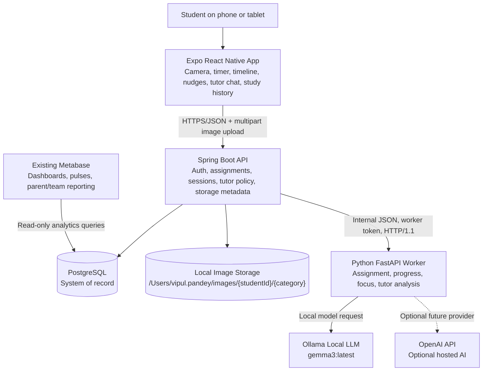
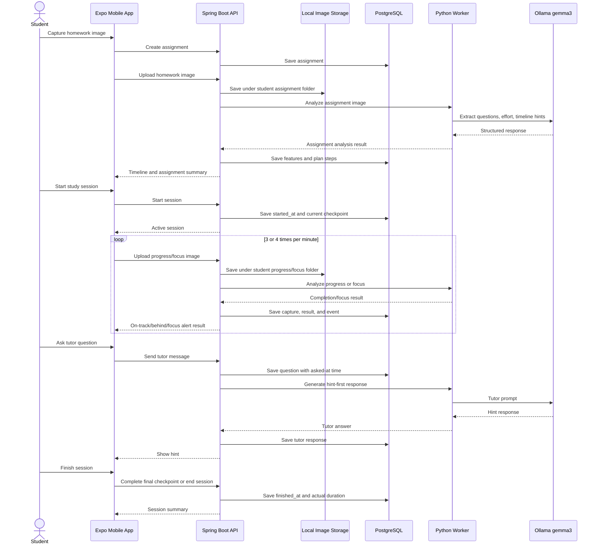
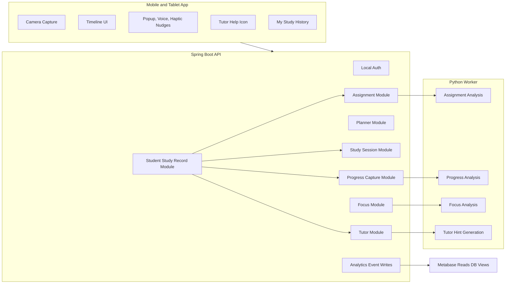
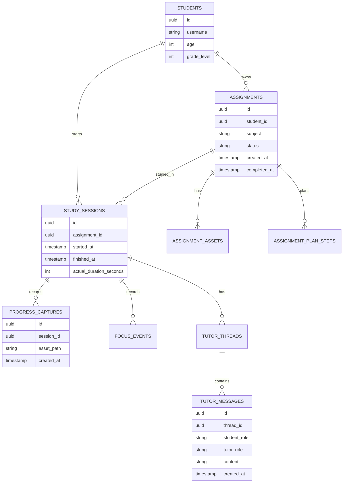

# AI Tutor Architecture Diagrams

Use this document for architecture walkthroughs and slide preparation. The diagrams are written in Mermaid so they can be rendered by GitHub, Mermaid Live Editor, Notion, Obsidian, and many presentation tools.

## 1. System Architecture



## 2. Runtime Flow



## 3. Product Modules



## 4. Data Ownership



## 5. Presentation Summary

```text
Student app captures homework and study progress.
Spring Boot owns product state and persistence.
Python worker handles AI/CV analysis behind internal APIs.
Ollama gives local AI without API keys; OpenAI can be added later.
PostgreSQL remains the source of truth.
Images are saved by student id and category.
Metabase reads analytics directly from the database.
```
